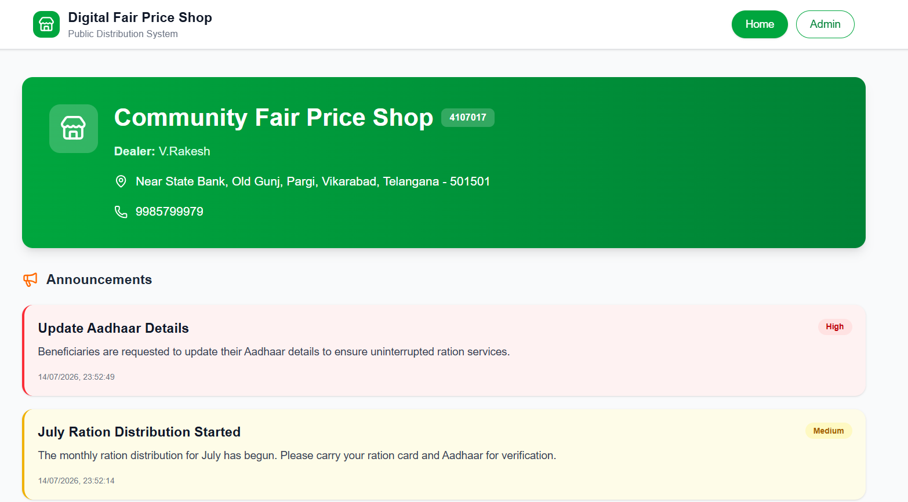
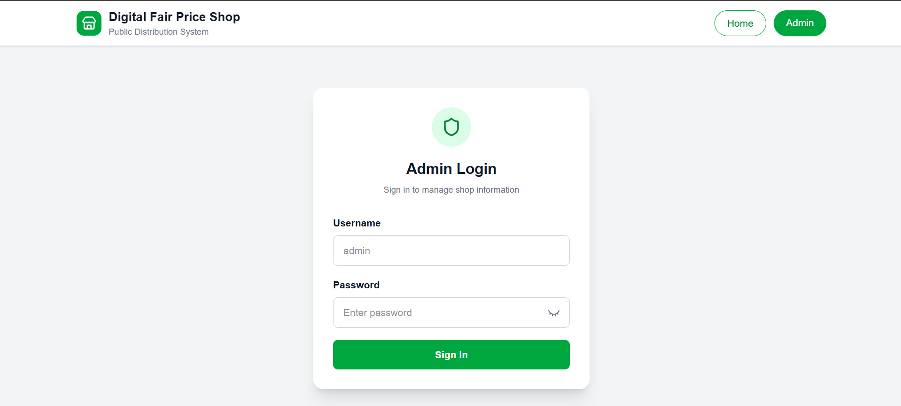

# 🏪 Digital Fair Price Shop Management System

A full-stack web application built using **Next.js 16**, **MongoDB Atlas**, and **NextAuth v5** to digitally manage a Fair Price Shop (Public Distribution System). The system provides a responsive interface for citizens to view shop information while enabling administrators to manage stock, announcements, and shop details securely.

## 🌐 Live Demo

🔗 https://fps-management-system.vercel.app

---

# ✨ Features

## 👥 Public User

- 🏪 View Fair Price Shop information
- 📢 Read latest announcements
- 📦 Check stock availability
- 🕒 View shop timings
- 📱 Fully responsive mobile-friendly UI

## 🔐 Admin

- Secure login using NextAuth Credentials Authentication
- Dashboard with role-based access
- Manage stock inventory
- Add, edit and delete announcements
- Update shop information
- Modify shop timings
- Protected routes using middleware

---

# 🛠 Tech Stack

### Frontend

- Next.js 16 (App Router)
- React 19
- TypeScript
- Tailwind CSS
- Lucide React Icons

### Backend

- Next.js API Routes
- MongoDB Atlas
- Mongoose

### Authentication

- NextAuth v5
- JWT Session Strategy
- bcryptjs Password Hashing

### Deployment

- Vercel

---

# 📂 Project Structure

```
src
│
├── app
│   ├── admin
│   ├── api
│   ├── layout.tsx
│   └── page.tsx
│
├── components
│
├── lib
│   └── db.ts
│
├── models
│
├── auth.ts
│
└── proxy.ts
```

---

# 🔒 Authentication

- JWT Based Authentication
- Passwords stored using bcrypt hashing
- Protected Admin Dashboard
- Role-based Authorization
- Middleware Route Protection

---

# 📸 Screenshots

## User Dashboard



---

## Admin Login



---

## Admin Dashboard


---

# ⚙️ Installation

Clone the repository

```bash
git clone https://github.com/Harsha20061/FPS-MANAGEMENT-SYSTEM.git
```

Go to project directory

```bash
cd FPS-MANAGEMENT-SYSTEM
```

Install dependencies

```bash
npm install
```

Create a `.env.local`

```env
MONGODB_URL=your_mongodb_connection_string

AUTH_SECRET=your_secret_key

AUTH_URL=http://localhost:3000
```

Run development server

```bash
npm run dev
```

Open

```
http://localhost:3000
```

---

# 🚀 Deployment

This project is deployed on **Vercel**.

Environment Variables used

```
MONGODB_URL

AUTH_SECRET

AUTH_URL
```

---

# 📱 Responsive Design

- Desktop
- Tablet
- Mobile

---

# 🔐 Admin Credentials

For security reasons, admin credentials are **not included** in this repository.

Create an admin document manually in MongoDB Atlas with a bcrypt hashed password.

---

# Future Improvements

- QR Code Integration
- SMS Notifications
- Online Ration Booking
- Stock Analytics Dashboard
- Multiple Admin Roles
- PDF Reports
- Email Notifications
- Dark Mode

---

# 👨‍💻 Developer

**Chandra Harsha Varla**

📧 Email:
chandraharshavarala@gmail.com

🔗 GitHub:
https://github.com/Harsha20061

🔗 LinkedIn:
https://www.linkedin.com/in/varla-chandra-harsha-176848259/

---

# ⭐ Support

If you found this project helpful, consider giving it a ⭐ on GitHub.

---